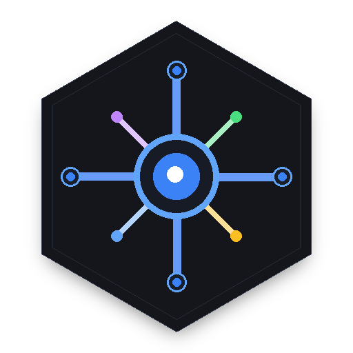

# AgentProxyHub

**AIエージェント、指紋偽装ブラウザ、複数アカウント運用のためのインテリジェント分散プロキシハブ**

[-purple.svg?style=flat-square)](mcp/server.py)

[中文说明](README.md) | [English](README_EN.md) | [日本語](README_JA.md) | [한국어](README_KO.md)

---

### 💡 AgentProxyHub が必要な理由

海外の複数アカウント運用、指紋偽装ブラウザ（P1、CloakMulti、AdsPowerなど）、Claude Code や自動クローラーを実行する際、従来のプロキシツールには大きな課題がありました：

1. **単一ポートによるアカウント連動凍結リスク**：通常のクライアントは `7890` などの単一ポートしか開放せず、複数プロファイルが同一IPを共有するため、芋づる式にアカウントがBANされます。
2. **AIとSNSのリスク制御ブラックボックス**：通常のWebサイトは開けても、AnthropicでCloudflare 1020エラー、Google判定が中国送致（送中）、Facebook登録でデータセンターIPが即死するなど、手動テストは非常に非効率です。
3. **エージェントからのプログラマブル制御が不可**：AI（Cursor、Claude Desktopなど）がローカルポートの健全性を認識できず、特定タスクに固定住宅IPを自動割り当てできませんでした。

**AgentProxyHub** は、上流サブスクリプション（Clash/Mihomo）をローカルの連続した独立ポートプール（SOCKS5 `20001+` / HTTP `30001+`）に自動マッピングし、**ルール駆動型シナリオテスト（`scenes.json`）** と **標準MCPプロトコル** を通じて、人間とAIエージェントのシームレスな協調を実現します。

---

### ✨ 主な機能

- 🔌 **1ノード1独立ポート**：1つのサブスクリプションから80〜120個以上の独立ローカルポートプール（SOCKS5 & HTTP CONNECT）を自動生成。
- 🎯 **シナリオ別適合ベンチマーク**：
  - **✨ Gemini / Antigravity**：Google公式地域認定、送中ノードの完全排除。
  - **🟣 Claude 専用**：`api.anthropic.com` へのダイレクト接続、Cloudflare遮断の防止。
  - **🟢 ChatGPT / OpenAI**：高速APIストリーミング通信の検証。
  - **🔵 Facebook / 海外SNS**：住宅/プロバイダIPの厳格選定、IP重複の防止。
- 🧩 **`scenes.json` による容易な拡張**：TikTokやTwitterなどの新規ルールも、JSONに数行追加するだけで自動認識。
- 🤖 **標準MCPプロトコル対応**：Claude Desktop や Cursor から自律的に最適なノードの検索・バインドが可能。
- 📱 **スマホ/LAN向けスマートゲートウェイ**：`192.168.0.107:39999` などを通じて、アプリ未インストールのスマホやタブレットでも自動最適化プロキシを共有可能。

---

### 📦 コンパイル済みリリース版ダウンロード（推奨）

> **開発環境の構築は不要です。すぐに実行できる配布パッケージを用意しています。**

1. 右側の **[Releases ページ](https://github.com/ningnuo-dot/AgentProxyHub/releases)** へアクセス；
2. `AgentProxyHub-v1.0.0-windows-x64.zip` をダウンロード；
3. 任意のフォルダに解凍；
4. **`启动AgentProxyHub.bat`** をダブルクリックするだけでコントロールパネルが起動します！

---

### 📄 ライセンス
本プロジェクトは [MIT ライセンス](LICENSE) のもとで公開されています。
